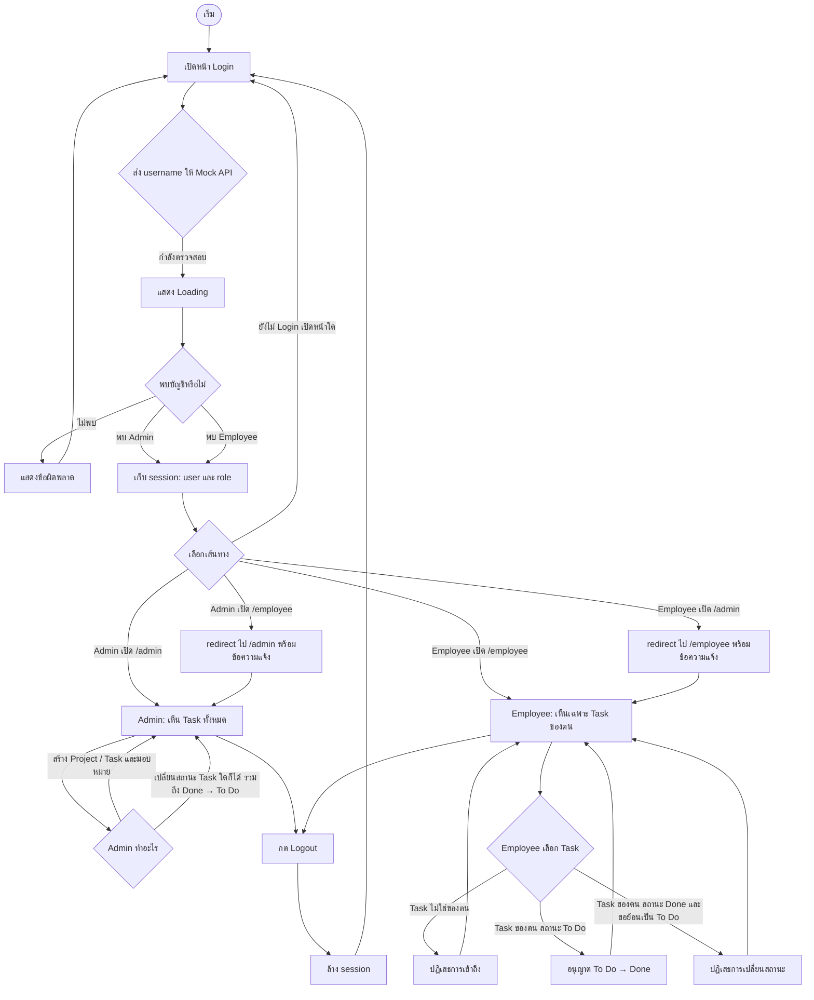

```mermaid
flowchart TD
    A([เริ่ม]) --> B[เปิดหน้า Login]
    B --> C{ส่ง username ให้ Mock API}
    C -->|กำลังตรวจสอบ| C1[แสดง Loading]
    C1 --> C2{พบบัญชีหรือไม่}
    C2 -->|ไม่พบ| C3[แสดงข้อผิดพลาด]
    C3 --> B
    C2 -->|พบ Admin| D[เก็บ session: user และ role]
    C2 -->|พบ Employee| D
    D --> E{เลือกเส้นทาง}
    E -->|Admin เปิด /admin| F[Admin: เห็น Task ทั้งหมด]
    E -->|Employee เปิด /employee| G[Employee: เห็นเฉพาะ Task ของตน]
    E -->|ยังไม่ Login เปิดหน้าใด| B
    E -->|Employee เปิด /admin| G1[redirect ไป /employee พร้อมข้อความแจ้ง]
    E -->|Admin เปิด /employee| F1[redirect ไป /admin พร้อมข้อความแจ้ง]
    G1 --> G
    F1 --> F
    F --> H{Admin ทำอะไร}
    H -->|สร้าง Project / Task และมอบหมาย| F
    H -->|เปลี่ยนสถานะ Task ใดก็ได้ รวมถึง Done → To Do| F
    G --> I{Employee เลือก Task}
    I -->|Task ไม่ใช่ของตน| I1[ปฏิเสธการเข้าถึง]
    I -->|Task ของตน สถานะ To Do| I2[อนุญาต To Do → Done]
    I -->|Task ของตน สถานะ Done และขอย้อนเป็น To Do| I3[ปฏิเสธการเปลี่ยนสถานะ]
    I1 --> G
    I2 --> G
    I3 --> G
    F --> J[กด Logout]
    G --> J
    J --> K[ล้าง session]
    K --> B

```